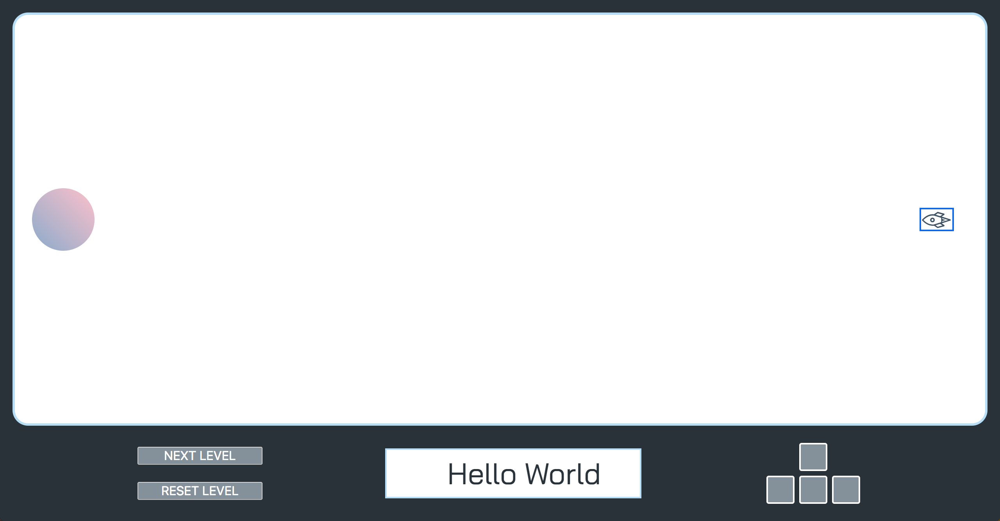

# JS Adventure Coding Challenges

The purpose of this project is to support your learning path by helping you apply the concepts you have learned in your Javascript courses. JS adventure is a game.

The goal of the game will be the same through out all the coding challenges: Land the spaceship on the planet to complete the level.
Things may change a little from challenge to challenge but overall the goal will be the same.

Each challenge will have some functionality "missing" that you will be responsible for "fixing" or implementing. You will be instructed about what is broken along with a little help on how to fix it. Once it is fixed and the game is working as indicated in the instructions, you have completed the challenge.

After you complete a challenge, you will commit your code and move on to checking out a new challenge branch.

YAY! This might be confusing at first so reach out to a mentor to get you started during class time.

## Intro / Setup

To start you are going to clone this repository (DO NOT FORK). Just cloning this repository means that you won't have your own copy on github and you will not be able to push changes. But we are doing this because when we update challenges I want you to have access to them. Don't worry! you will have all your coding work stored locally on your computer with git.

Go ahead and clone this repo to your computer.
1. Click the green "Clone or Download" button above.
2. Copy the HTTPS url that is shown in the popup.
3. On your computer, open your terminal and navigate to your CoderGirl project directory.
4. Now in that directory run `git clone https://github.com/ktmathews89/js_adventure.git`

That's it. Now if you do a `ls` in your terminal you should see the js_adventure directory!

## Install

Before you do anything there are couple things you need to know to get this site up and running. Some ES6 javascript syntax is not supported in all browsers. So in order to write ES6 javascript, we will use node, npm and webpack. Yay! New things!

These are very common frontend web development tools. In fact, you will keep using these tools when you learn a Javascript Framework (like Angular, React or Vue). So why not introduce you to them now, the more practice the better.

**Installing Node && NPM**

Thankfully Treehouse has written some articles on installing these tools for us.

[Mac Install Node & NPM](https://blog.teamtreehouse.com/install-node-js-npm-mac)

[Windows Install Node & NPM](https://blog.teamtreehouse.com/install-node-js-npm-windows)

**Using Node && NPM for this Project**

First, you are going to need to do a ONE TIME install in your project directory. Again, this is the only time you will have to do this part.

1. Open your terminal and navigate into your `js_adventure` git repository.
2. Run `npm install`. Your computer should start installing somethings. When it is finished and you have your terminal command line back. Run `ls` and check if you have a `node_modules` directory. If you do, it worked! If not, contact a mentor on slack :)

Now open the `index.html` file in Chrome and the game should work!

**Updating files**

When editing the javascript files for this project. You will need to run another `npm` command. Since ES6 isn't completely supported in browsers and we still want to use it, we need to use a tool to compile our code into plain javascript so the browser can read it. For that we will use webpack. It's a common tool for web development (and you will probably use it with a frontend framework).

If you change the javascript files, you will have to run this command:

`npm run build`

However, to avoid having to run this command after every javascript change. You can run the following command:

`npm run watch-build`

Then npm will watch your files for changes and compile them automatically.
